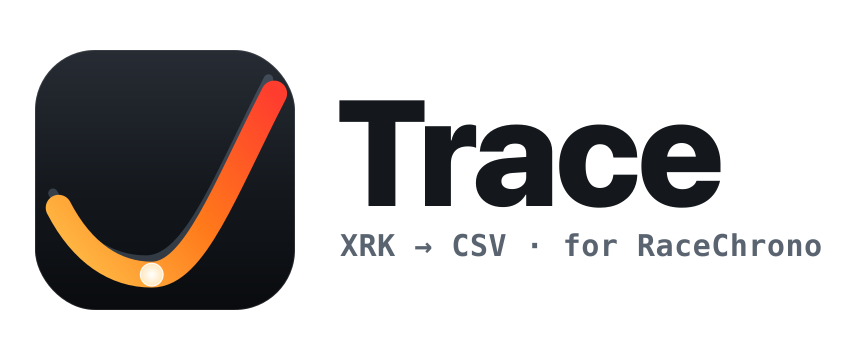
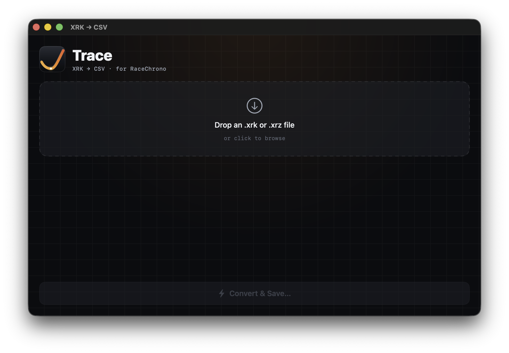
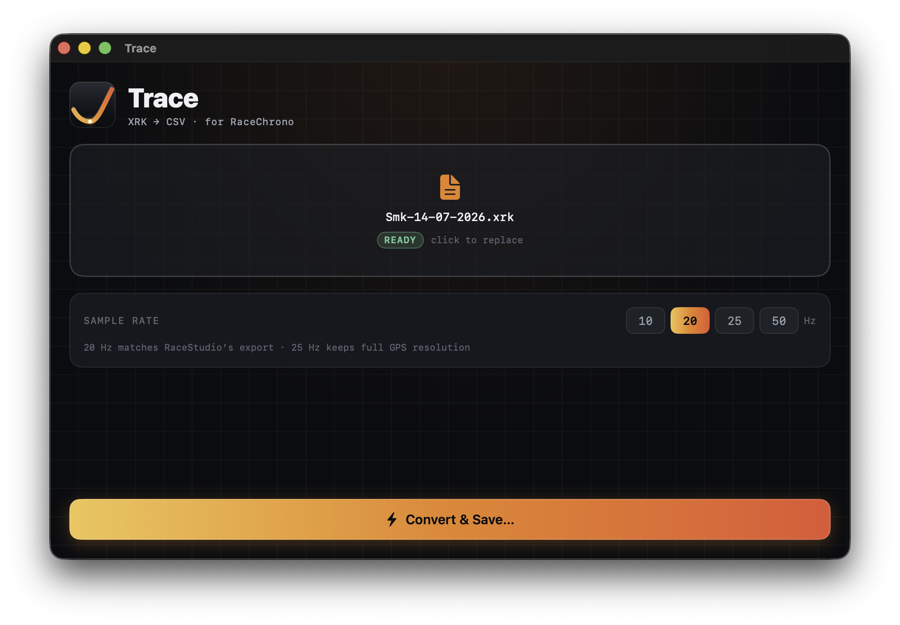
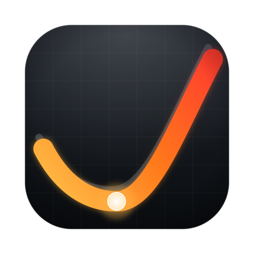

<h1 align="center">
  <picture>
    <source media="(prefers-color-scheme: dark)" srcset="branding/trace-wordmark-dark.svg">
    
  </picture>
</h1>

<p align="center">
  <b>Trace</b> is a native macOS app that converts AiM <b><code>.xrk</code> / <code>.xrz</code></b>
  telemetry files (from RaceStudio 3 / MyChron) into an <b>AiM CSV</b> that <b>RaceChrono</b>
  can import — no Windows, no RaceStudio desktop, no proprietary AiM DLL required.
</p>

The heavy lifting (parsing AiM's undocumented binary format) is done by
[**libxrk**](https://github.com/m3rlin45/libxrk) — a pure, MIT-licensed,
cross-platform reimplementation with native Apple-Silicon wheels. This project
wraps it in a Python converter + a SwiftUI front end, with Python embedded so
the shipped `.app` is self-contained.





## Status

Working end-to-end. Conversion output has been validated against RaceStudio's
own reference CSV export to **millimetre GPS accuracy** and ~zero speed error
(see below). The one step that still needs your hardware is confirming the CSV
imports cleanly into RaceChrono with one of *your* MyChron files.

## Download & install

Grab the latest **`Trace-macos-arm64.dmg`** from the
[**Releases**](https://github.com/Zenardi/XRKConverter/releases) page
(Apple Silicon, macOS 13+).

1. Open the `.dmg` and **drag `Trace.app` into your `Applications` folder.**
   You can't run it from the mounted disk image — copy it out first.
2. **First launch only.** The app is code-signed but not yet *notarized* by
   Apple, so macOS shows a *“cannot verify… malware”* warning the first time.
   Clear it once, either way:
   - **No Terminal:** double-click Trace, dismiss the warning, then open
     **System Settings → Privacy & Security**, scroll down to the line about
     Trace, and click **Open Anyway** → **Open**.
   - **Terminal:** `xattr -dr com.apple.quarantine /Applications/Trace.app`
3. After that one-time step it opens normally on every later launch (just
   double-click — no warnings).

> Copying to `Applications` alone isn't enough — because the build isn't
> notarized, the download stays “quarantined” until you do step 2. It's a
> **one-time** action per download, not per launch. The warning is only about
> the missing paid Apple signature; the app is self-contained and runs entirely
> offline. *(Maintainers: add the `MACOS_*` secrets — see
> [Signed & notarized releases](#signed--notarized-releases) — to ship notarized
> builds that open with no warning at all.)*

## Architecture (Option A: SwiftUI + embedded Python)

```
XRKConverter/
├── core/
│   ├── xrk2csv.py          # the converter (libxrk -> AiM CSV), CLI + --json
│   └── tests/test_convert.py
├── app/
│   ├── Package.swift        # SwiftPM (builds with Command Line Tools, no Xcode)
│   ├── Sources/XRKConverter/
│   │   ├── App.swift            # SwiftUI UI (drag-drop, rate, progress, save)
│   │   └── ConversionModel.swift# runs the Python converter, parses JSON stream
│   └── Resources/python/    # embedded, relocatable CPython + libxrk (build artifact)
├── branding/               # logo: trace-appicon.svg, AppIcon.icns, wordmark, mono mark
├── scripts/
│   ├── bundle_python.sh     # download python-build-standalone + pip install libxrk
│   ├── build_app.sh         # swift build + assemble Trace.app (embeds AppIcon.icns)
│   └── build_icons.sh       # regenerate AppIcon.icns from the SVG master
├── samples/                 # test .xrk files + a RaceStudio reference .csv
└── dist/Trace.app    # the built application
```

The Swift UI never parses anything itself — it shells out to
`Resources/python/bin/python3 Resources/xrk2csv.py <in> -o <out> --rate N --json`
and renders the newline-delimited JSON progress/result the script emits.

## Build

Requirements: macOS 13+, Apple Silicon, Xcode **Command Line Tools** (no full
Xcode needed), network access for the first build.

```bash
# 1. Download + embed a relocatable Python with libxrk (~170 MB, cached after first run)
bash scripts/bundle_python.sh

# 2. Build the Swift app and assemble the .app bundle
bash scripts/build_app.sh

# 3. Run it
open dist/Trace.app
```

## Use

1. Drag a `.xrk` (or `.xrz`) onto the window, or click to browse.
2. Pick a sample rate (default **20 Hz**, matching RaceStudio's export; 25 Hz
   preserves full native GPS resolution).
3. **Convert & Save…** → choose where to write the `.csv`.
4. In RaceChrono: **Import** the CSV as an AiM/CSV session.

## The converter (standalone CLI)

`core/xrk2csv.py` works on its own with any Python that has `libxrk` installed:

```bash
pip install libxrk
python core/xrk2csv.py session.xrk -o session.csv --rate 20
```

What it does:
* Resamples every channel to a uniform grid (RaceStudio-style AiM CSV).
* Converts **GPS speed m/s → km/h** (and velocity-accuracy likewise).
* Synthesises **GPS Heading** as the great-circle bearing between fixes — the
  XRK has no heading channel, and RaceChrono uses heading for accelerations.
* Emits latitude/longitude at **8 decimal places** (sub-cm) — critical for the
  racing line; the rest use each channel's native display precision.
* Writes the `"Format","AiM CSV File"` header block, beacon (lap) markers,
  channel-name + units rows, then quoted data. No trailing comma in the header
  (a known RaceChrono parser requirement).

## Validation

`core/tests/test_convert.py` converts the bundled Fuji Speedway sample and
cross-checks it against RaceStudio's reference CSV. Over 28,001 driving samples:

| Channel | Agreement vs RaceStudio |
|---|---|
| GPS Speed | mean error ~3e-6 km/h |
| GPS position (lat/long) | mean & max ~**4 mm** |
| GPS Altitude | ~8 mm |
| RPM | exact |
| Brake / steering / accel | rounding only (≤0.05 unit) |
| GPS Heading | mean 0.8°, p99 5° (bearing vs their filtered heading) |

```bash
cd core/tests && ../../.venv/bin/python -m unittest -v test_convert
```

## Known caveats / roadmap

* **Bundle size ~170 MB.** pyarrow (a libxrk dependency) is the bulk and its
  core libraries are hard-linked, so it can't be trimmed much further. A future
  Rust or pure-Swift port of the parser (Options B/C) would shrink this to a few
  MB — the conversion logic here is the reference for that.
* **Reverse-engineered format.** libxrk is a clean-room reimplementation; a
  future MyChron firmware could change the layout. Pin libxrk and test with your
  own files.
* **Heading at stops** can spike (bearing is undefined when stationary); held at
  the last valid value. Harmless — RaceChrono recomputes heading from position.
* **Distribution.** The app is ad-hoc signed for local use. To share it without
  Gatekeeper warnings you need an Apple Developer ID signature + notarization.
* **Apple Silicon only** as bundled (arm64 Python). Add the `x86_64` python-
  build-standalone asset to `bundle_python.sh` for a universal build.

## Development (TDD, coverage, CI/CD)

Development is **test-first**, with a **≥95% line-coverage floor** on the logic
core (the Python converter + the Swift `XRKConverterCore` library). SwiftUI view
code is intentionally kept thin and excluded from the metric.

```bash
make setup      # venv + deps + fetch test fixtures
make test       # run Python + Swift suites
make coverage   # enforce the 95% gate (Python 100%, Swift Core ~98%)
make e2e        # convert every sample through the shipping pipeline + validate
make lint       # ruff (Python) + swiftlint (if installed)
make app        # bundle Python + build the .app
make ci         # what CI runs
```

Test layout:
- `core/tests/` — `unittest` + `coverage.py`. Pure functions, synthetic
  `LogFile` branch tests, CLI tests, and a reference-CSV comparison.
- `app/Tests/XRKConverterCoreTests/` — **swift-testing** (`import Testing`).
  Pure parsing/state tests + subprocess integration tests.
- `scripts/e2e.sh` + `scripts/validate_csv.py` — end-to-end: convert real files
  through the embedded runtime and assert the CSV is RaceChrono-importable.

> **No full Xcode?** The Swift tests use swift-testing, which ships with the
> Command Line Tools but needs its framework search path. `scripts/swift_test.sh`
> adds it automatically when running under CLT (a no-op under full Xcode/CI).

### CI / CD (GitHub Actions)

- **`.github/workflows/ci.yml`** (push/PR): ruff lint → 95% coverage gate →
  end-to-end validation on macOS, plus a **Trivy** CVE/secret/misconfig scan.
- **`.github/workflows/release.yml`** (push a `v*` tag): re-runs the gate, then
  builds `Trace.app`, packages a **`.dmg` + `.zip` (+ SHA256SUMS)**, and
  publishes them to a **GitHub Release** you can download directly.

  ```bash
  git tag v0.1.0 && git push origin v0.1.0   # cuts a downloadable release
  ```

#### Signed & notarized releases

The release workflow **signs (Developer ID + hardened runtime) and notarizes**
the build automatically — but only when the required secrets are set. Without
them it falls back to an ad-hoc signature (first launch then needs a right-click
→ Open, or `xattr -dr com.apple.quarantine Trace.app`).

To enable warning-free downloads, add these **GitHub repository secrets**
(Settings → Secrets and variables → Actions):

| Secret | What it is |
|---|---|
| `MACOS_CERTIFICATE_P12_BASE64` | `base64` of your *Developer ID Application* cert exported as `.p12` |
| `MACOS_CERTIFICATE_PASSWORD` | password for that `.p12` |
| `MACOS_SIGN_IDENTITY` | e.g. `Developer ID Application: Your Name (TEAMID)` |
| `MACOS_NOTARY_KEY_P8_BASE64` | `base64` of your App Store Connect API key (`AuthKey_XXXX.p8`) |
| `MACOS_NOTARY_KEY_ID` | the key's Key ID |
| `MACOS_NOTARY_ISSUER_ID` | your App Store Connect issuer ID |

Get the cert from the [Apple Developer](https://developer.apple.com/account/resources/certificates)
portal (needs a paid Developer account) and the API key from App Store Connect →
Users and Access → Integrations → App Store Connect API. Base64 a file with
`base64 -i AuthKey_XXXX.p8 | pbcopy`. Entitlements live in
`app/XRKConverter.entitlements` (library-validation exemption for the embedded
Python's compiled extensions).

## Branding



The app is called **Trace** — a telemetry *trace* (the brake / throttle / GPS curve
you analyse) and the act of *tracing* your data out of the locked XRK format into a
CSV. The mark is a single amber→red racing line clipping a glowing **apex node** on a
carbon instrument-panel tile — it reads at once as a racing line through a corner and
a data trace being plotted.

All assets live in [`branding/`](branding/):

| File | Purpose |
|---|---|
| `trace-appicon.svg` | Master app icon — fully vector |
| `AppIcon.icns` | 10-size macOS iconset (16→1024), embedded into the `.app` by `build_app.sh` |
| `trace-wordmark.svg` + `-dark.svg` | Horizontal lockup — light/dark pair, swapped via `<picture>` |
| `trace-mark-mono.svg` | Single-colour mark (`currentColor`) for menu-bar / favicon |
| `trace-appicon-{1024,512}.png` | Raster renders for docs |

The icon is wired into the bundle through `Info.plist` (`CFBundleIconFile = AppIcon`).
Both the icon and the wordmark regenerate from source with stock macOS tools only
(no ImageMagick / Inkscape):

```bash
bash  scripts/build_icons.sh      # SVG master -> AppIcon.icns (+ doc PNGs)
swift scripts/build_wordmark.swift # outlines the wordmark text to vector paths
```

The wordmark text is **outlined to vector paths** (via CoreText), so it renders
identically everywhere with no font dependency.

<br clear="left">

## Credits

* [libxrk](https://github.com/m3rlin45/libxrk) — MIT — the XRK/XRZ parser
  (incorporates code from Scott Smith's *TrackDataAnalysis*).
* [python-build-standalone](https://github.com/astral-sh/python-build-standalone)
  — the relocatable CPython runtime.
